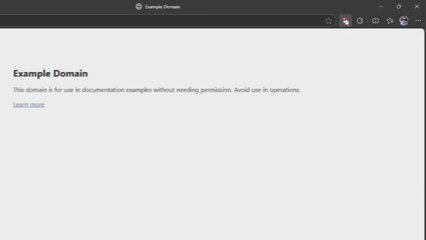

<h1>
  
  Poké-Pause
</h1>

Open-source can be tough. When your brain demands a break, give it a joyful ride down memory lane with Pokémon from your childhood!  

---

## 🚀 About the Project  

Poké-Pause started with a simple question: **what if we could take a quick break from adulting and revisit the joyful magic of our childhood?**  

Life and work can get stressful, and sometimes your brain just needs a tiny, happy escape. That’s where Poké-Pause comes in 🎉.

This extension brings random Pokémon and their fun facts straight to your browser, **giving you mini-moments of nostalgia and joy**  

- **🧩 Random Pokémon** – Rediscover your favorite creatures or meet new ones.
- **📚 Fun Facts** – Learn quirky tidbits about each Pokémon, sparking curiosity.
- **🌈 Stress Relief** – A small, delightful break for your brain anytime you need it  

These tiny bursts of fun aren’t just distractions—they’re reminders of the wonder, curiosity, and excitement of childhood. Suddenly, your workday feels lighter, and your inner child gets a chance to smile.

👉 And that’s the main goal of this project: **to celebrate childhood memories, make learning about Pokémon playful, and bring a bit of magic to everyone’s day.**  

We want you to join the adventure! Whether it’s adding new Pokémon API's, improving facts, or making the extension even more fun, every contribution helps make Poké-Pause a joyful experience for all ages.

**Let’s create a space where anyone, no matter how old, can pause, smile, and remember why Pokémon captured our hearts in the first place.**

## 🤔 How It Works?

**Poké-Pause** is a Chrome Extension designed to bring you **random Pokémon and fun facts** whenever you need a quick stress-relief break. It’s inspired by childhood memories and built to be **simple, playful, and educational**.  

The extension fetches Pokémon data using the **PokéAPI** and displays them in a friendly, visually appealing popup.  

## License
This project is licensed under the MIT License - see the [LICENSE](./LICENSE.md) file for details.

## Code of Conduct
This project follows the [Code of Conduct](./CODE_OF_CONDUCT.md). By participating, you are expected to uphold this code.
